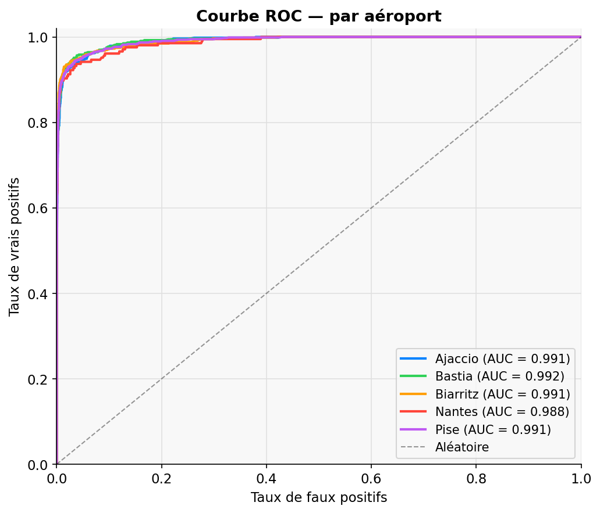
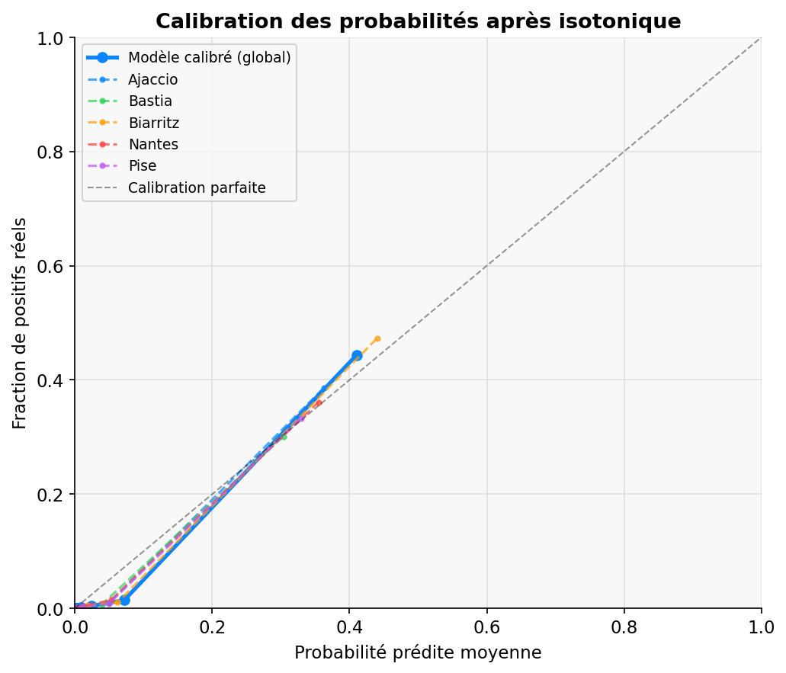
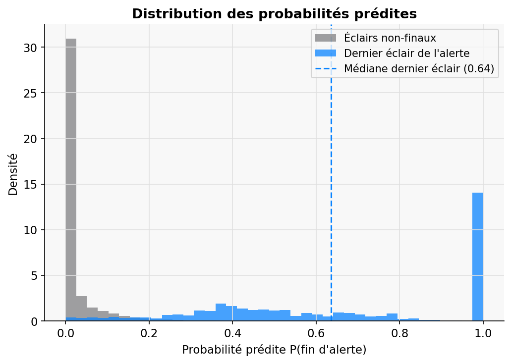
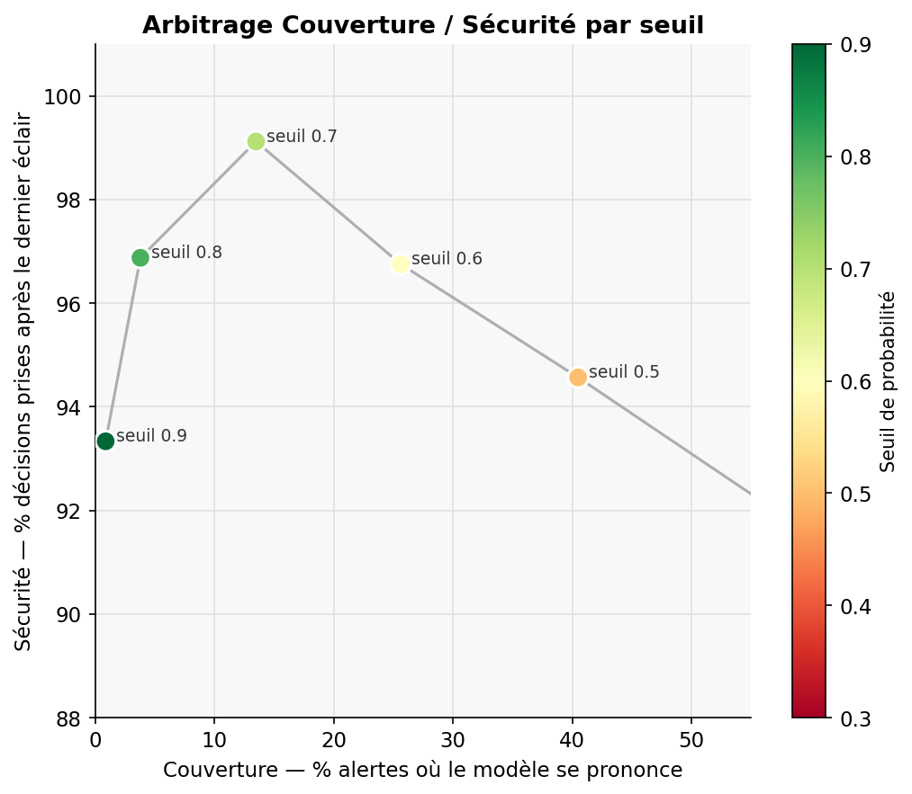
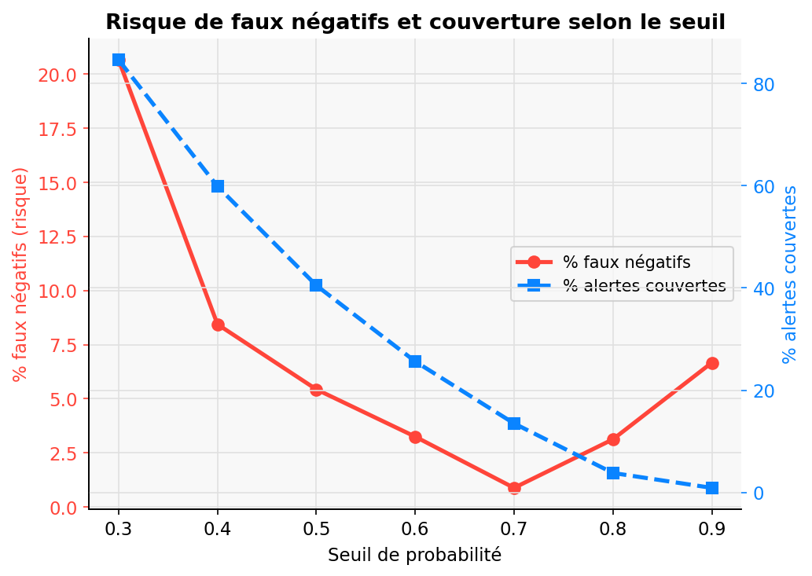
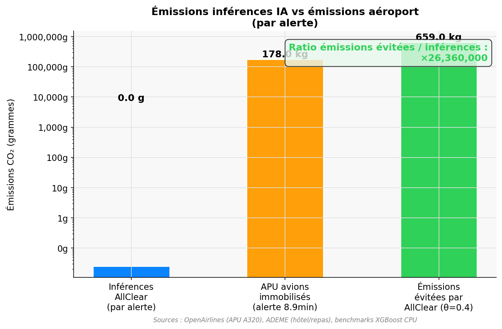
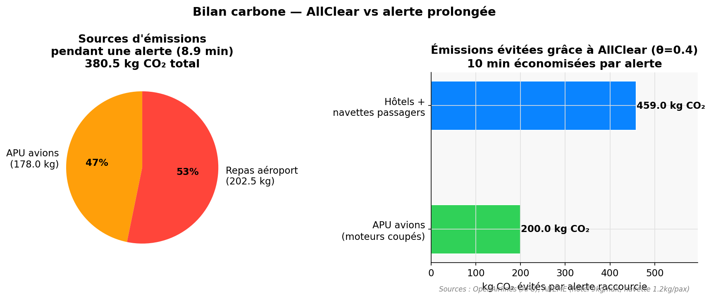
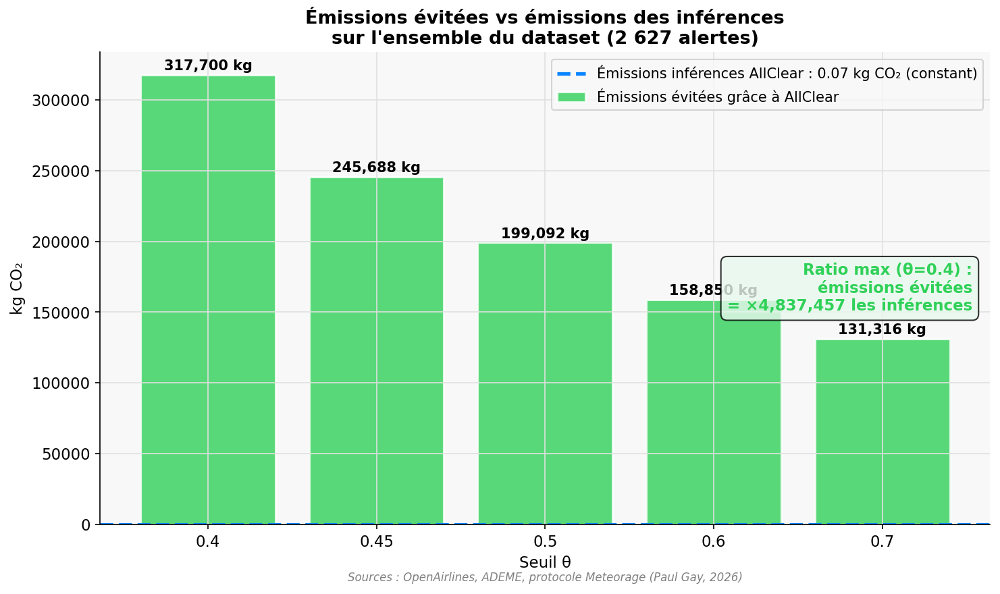

# 🏆 Data Battle IA PAU 2026 – AllClear

## 👥 Équipe
- Nom de l'équipe : AllClear
- Membres :
  - Mehdi Khabouze
  - Hiba Knizia
  - Kenza Rzal
  - Ilhame Daoui

## 🎯 Problématique
Les aéroports appliquent une règle fixe : attendre 30 minutes après le dernier éclair détecté à moins de 6 miles avant de rouvrir les pistes. Cette règle ignore la dynamique réelle de l'orage et génère des immobilisations coûteuses (~12 000 $/minute). L'objectif est de remplacer ce délai fixe par une probabilité de fin d'alerte mise à jour en temps réel, éclair par éclair.

## 💡 Solution proposée
Un modèle XGBoost avec calibration isotonique qui, à chaque éclair nuage-sol détecté, produit P(fin d'alerte). 36 features construites par fenêtres glissantes temporelles (5/10/15/30 min), incluant un comptage dédié des éclairs à moins de 3 km (zone de danger opérationnel). À θ=0.3 : gain de 1 331 heures sur le dataset d'entraînement, risque R=1.84% < 2% (protocole Meteorage). AUC-ROC : 0.966 — Brier Score : 0.018.

## ⚙️ Stack technique
- Langages : Python 3.8+, HTML/CSS/JavaScript
- Frameworks : XGBoost, scikit-learn, pandas, numpy, matplotlib
- Outils : Leaflet.js, Chart.js, PapaParse
- IA (si utilisé) : XGBoost + calibration isotonique (CalibratedClassifierCV)

## 📊 Résultats

### Performances globales

| Métrique | Valeur |
|---|---|
| AUC-ROC global | **0.966** |
| Brier Score | **0.018** |
| Gain de temps (θ=0.4, données test) | **150 heures** |
| Risque R (θ=0.4) | **1.85%** (< seuil 2%) |

### Courbe ROC par aéroport

Le modèle discrimine très bien le dernier éclair des autres sur les 5 aéroports, avec des AUC entre 0.988 et 0.992.



### Calibration des probabilités

Après calibration isotonique, les probabilités produites sont fiables : une valeur de 0.7 correspond à 70% de fins d'alerte réelles.



### Distribution des probabilités prédites

Les éclairs non-finaux ont une probabilité quasi nulle, tandis que les derniers éclairs forment un pic net à droite.



### Arbitrage couverture / sécurité par seuil

Compromis entre le pourcentage d'alertes couvertes et la sécurité des décisions selon le seuil θ.



### Risque de faux négatifs selon le seuil

Le risque de faux négatifs décroît avec le seuil. À θ=0.4, risque de 1.85% — en dessous du seuil de 2% fixé par Meteorage.



### Arbitrage θ / Gain / Risque (données test Meteorage)

| θ | Gain (heures) | Risque R | Safe ? |
|---|---|---|---|
| 0.30 | 259 | 0.040 | ❌ |
| 0.35 | 192 | 0.026 | ❌ |
| **0.40** | **150** | **0.0185** | **✅** |
| 0.45 | 116 | 0.0180 | ✅ |
| 0.50 | 94 | 0.0035 | ✅ |

*Source : évaluation protocole IA PAU 2026, Paul Gay (Meteorage)*

### Bilan carbone

L'empreinte des inférences AllClear est négligeable comparée aux émissions évitées. Sur une alerte entière, **0.025g de CO₂** pour les inférences, contre **659 kg CO₂ évités** grâce à la réduction de l'alerte.



En raccourcissant une alerte, AllClear évite les émissions APU des avions immobilisés (400 kg CO₂/h par A320, source : OpenAirlines) et les passagers contraints à des hôtels et navettes (source : ADEME).



Sur l'ensemble du dataset, les émissions évitées atteignent **317 700 kg CO₂** à θ=0.4, contre **0.07 kg CO₂** pour toutes les inférences — ce qui confirme que le choix de XGBoost est un choix responsable.



*Sources : OpenAirlines (APU A320), ADEME (hôtel 9kg CO₂/nuit, navette 1.2kg CO₂/pax), benchmarks XGBoost CPU*

## 🚀 Installation & exécution

### Prérequis
- Python 3.8+
- `segment_alerts_all_airports_train.csv` dans le répertoire racine
- `test_data/dataset_set.csv` dans le sous-dossier `test_data/`

### Installation
```bash
pip install xgboost scikit-learn pandas numpy matplotlib seaborn
```

### Exécution
```bash
# 1. Entraîner le modèle (génère model.pkl, predictions.csv, metrics.json)
python train.py

# 2. Générer les graphiques (génère charts/)
python generate_charts.py

# 3. Lancer l'interface web
python -m http.server 8000
# Ouvrir http://localhost:8000

# 4. Générer les prédictions pour soumission jury (données test)
python submit.py
```
